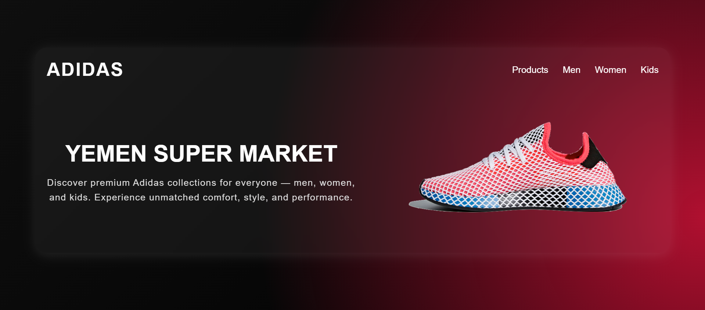

# 👟 Adidas Glass Design — Yemen Super Market 💎  



---

## 🌟 Overview  
Welcome to the **Adidas Glass Design Website** — a modern, minimal, and fully responsive web page inspired by **glassmorphism** ✨.  
This project beautifully blends **simplicity**, **luxury**, and **motion**, showcasing how powerful a design can be using only **HTML + CSS** — no frameworks, no JS, just art 💫.  

---

## 🎨 Features  
✨ Sleek **glassmorphism** design (blurred, semi-transparent container)  
📱 **Fully responsive** across all screen sizes  
🧠 Simple and **clean code structure** for easy customization  
🎞️ Smooth hover animations and transitions  
🎯 Perfect typography and balanced spacing  
🖼️ Modern background gradient with circular highlight  

---

## 🧰 Technologies Used  
- 🧱 **HTML5**  
- 🎨 **CSS3 (Flexbox + Media Queries)**  
- 💎 **Glassmorphism UI Design**  

---

## 🚀 How to Run Locally  

1. **Clone the repository**  
   ```bash
   git clone https://github.com/Basem0AlHersh123/Adidas-Glass-Design.git````

2. **Open the folder**

   ```bash
   cd Adidas-Glass-Design```

3. **Run the project**
   Simply open the file `index.html` in your browser 🌐

---

## 📸 Screenshot

Here’s how it looks 👇


---

## 💡 Project Structure

```
Adidas-Glass-Design/
│
├── index.html          # Main HTML file  
├── style.css           # CSS styles (if separated)  
├── shoes.png           # Website image  
└── screenshot.png      # Preview for GitHub  
```

---

## 🧑‍🎨 Author

**👨‍💻 Basem Al Hersh**

* 🏆 GitHub: [Basem0AlHersh123](https://github.com/Basem0AlHersh123)
* 💬 “Great design doesn’t need complexity — just clarity and soul.”

---

## 💖 Support & Feedback

If you liked this project, don’t forget to:
⭐ **Star** the repo — it really helps!
🗣️ Share it with friends learning web design!
💌 Open issues for suggestions and improvements.

---

### 🖤 Built with passion, designed with style — by Basem Al Hersh 🖤
